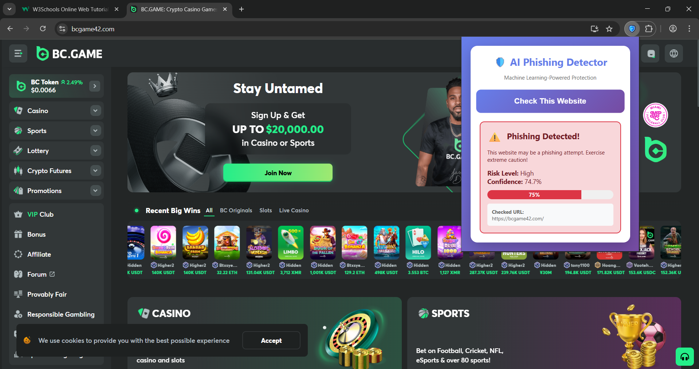
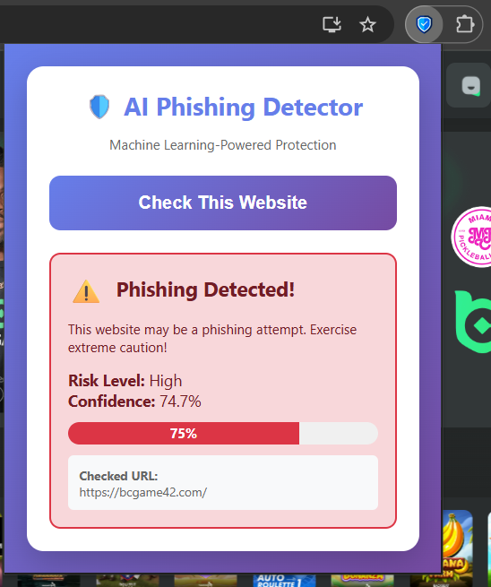
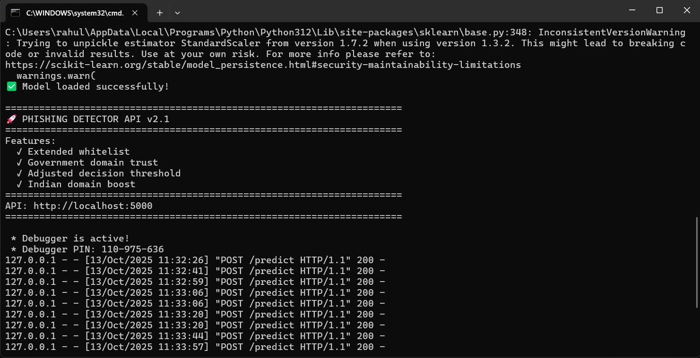

# 🛡️ AI-Powered Real-Time Phishing Website Detector

Real-time phishing website detection using Machine Learning with automatic browser protection.


---

## 📋 Table of Contents
- [Overview](#overview)
- [Features](#features)
- [Technology Stack](#technology-stack)
- [Project Structure](#project-structure)
- [Installation](#installation)
- [Usage](#usage)
- [Model Performance](#model-performance)
- [Screenshots](#screenshots)
- [Testing](#testing)
- [Team](#team)
- [Future Enhancements](#future-enhancements)
- [Contributing](#contributing)
- [License](#license)
- [Contact](#contact)

---

## 🎯 Overview

Phishing attacks are one of the most dangerous cyber threats, causing billions in financial losses annually. Traditional security methods like blacklist-based filters are often too slow to react to newly created phishing URLs.

This project implements an **AI-powered real-time phishing detection system** that uses machine learning to proactively identify phishing websites and automatically protects users while browsing.

### Key Highlights
- ✅ **96.8% Accuracy** on 235,795 URL dataset
- ✅ **Real-time Protection** via Chrome extension
- ✅ **Automatic Detection** - No manual checking needed
- ✅ **Indian Domain Support** - Government & banking sites whitelisted
- ✅ **Instant Warnings** - Visual alerts and desktop notifications
- ✅ **50+ Features Analyzed** - Comprehensive URL and webpage analysis
- ✅ **Zero-Day Protection** - Detects new phishing sites not in blacklists

---

## ✨ Features

### 🔒 Security Features
- **Automatic URL Scanning** - Every website checked in real-time as you browse
- **Visual Warning Banners** - Red banner alerts displayed on suspicious pages
- **Desktop Notifications** - System-level threat notifications
- **Badge Indicators** - Quick visual status on extension icon (✓ safe, ! danger)
- **Smart Caching** - Avoids re-checking same URLs (1-hour cache)
- **Whitelist Support** - Pre-approved safe domains (Google, GitHub, Gov sites)

### 🧠 Machine Learning Features
- **50+ Features Analyzed** - URL structure, webpage content, security indicators
- **Random Forest Algorithm** - Ensemble learning for high accuracy
- **Feature Importance Analysis** - Understand what makes sites suspicious
- **Confidence Scores** - Percentage-based threat assessment
- **Balanced Training** - Handles class imbalance effectively
- **Regularization** - Prevents overfitting for better generalization

### 🌐 User Features
- **One-Click Manual Check** - Extension popup for detailed URL analysis
- **Risk Level Classification** - Very Low, Low, Medium, High, Very High
- **Trusted Domain Whitelist** - Auto-approve known safe sites
- **Government Domain Support** - Auto-trust .gov.in, .edu.in, .ac.in domains
- **HTTPS Preference** - Boosts confidence for secure connections
- **No Signup Required** - Works locally, no account needed

---

## 🛠️ Technology Stack

### Backend
- **Language:** Python 3.8+
- **Framework:** Flask 3.0
- **ML Library:** scikit-learn 1.3.2
- **Data Processing:** pandas 2.1.4, numpy 1.26.2
- **Web Scraping:** BeautifulSoup4 4.12.2, Requests 2.31.0

### Frontend
- **Browser Extension:** Chrome Extension API (Manifest V3)
- **UI:** HTML5, CSS3, JavaScript (ES6)
- **Notifications:** Chrome Notifications API
- **Storage:** Chrome Storage API
- **Background Processing:** Service Workers

### Machine Learning
- **Algorithm:** Random Forest Classifier
- **Features:** 50 (URL-based + Content-based)
- **Training Data:** 235,795 URLs
- **Feature Scaling:** StandardScaler
- **Validation:** Cross-validation (5-fold)

### Dataset
- **Name:** PhiUSIIL Phishing URL Dataset
- **Total URLs:** 235,795
- **Legitimate URLs:** 134,850 (57.2%)
- **Phishing URLs:** 100,945 (42.8%)
- **Features:** 54 attributes (50 used after preprocessing)
- **Source:** [Kaggle Dataset](https://www.kaggle.com/datasets/ndarvind/phiusiil-phishing-url-dataset)

---

## 📁 Project Structure

```
phishing-detector-ai/
│
├── api/
│   └── app.py                             # Flask REST API server
│
├── extension/
│   ├── manifest.json                      # Extension configuration
│   ├── popup.html                         # User interface
│   ├── popup.js                           # UI logic
│   ├── background.js                      # Auto-detection service worker
│   ├── content.js                         # Page integration script
│   └── icon.png                           # Extension icon (128x128)
│
├── scripts/
│   ├── train_balanced_model.py            # Model training script
│   ├── feature_extraction.py              # Feature engineering functions
│   ├── explore_data.py                    # Data analysis script
│   └── test_features.py                   # Feature testing utility
│
├── screenshots/
│   ├── safe-site.png                      # Safe website detection demo
│   ├── phishing-detected.png              # Phishing warning demo
│   ├── warning-banner.png                 # Page warning banner
│   └── api-response.png                   # API response example
│
├── dataset/                               # ⚠️ Not included - download separately
│   └── PhiUSIIL_Phishing_URL_Dataset.csv  # Dataset (52 MB)
│
├── models/                                # ⚠️ Not included - train model first
│   ├── phishing_model_balanced.pkl        # Trained Random Forest model
│   ├── scaler.pkl                         # Feature scaler
│   └── feature_names.pkl                  # Feature list for prediction
│
├── README.md                              # This file
├── requirements.txt                       # Python dependencies
├── TESTING.md                             # Test documentation and results
└── .gitignore                             # Git ignore rules
```

---

## 🚀 Installation

### Prerequisites
- **Python:** 3.8 or higher
- **Browser:** Google Chrome (version 88+)
- **Package Manager:** pip
- **Git:** Optional, for cloning repository
- **RAM:** 4GB minimum, 8GB recommended
- **Storage:** 2GB free space

### Step 1: Clone Repository
```
git clone https://github.com/jatrahul91/phishing-detector-ai.git
cd phishing-detector-ai
```

### Step 2: Install Python Dependencies
```
pip install -r requirements.txt
```

**Dependencies installed:**
- flask==3.0.0
- flask-cors==4.0.0
- scikit-learn==1.3.2
- pandas==2.1.4
- numpy==1.26.2
- requests==2.31.0
- beautifulsoup4==4.12.2

### Step 3: Download Dataset
1. Visit [Kaggle PhiUSIIL Dataset](https://www.kaggle.com/datasets/ndarvind/phiusiil-phishing-url-dataset)
2. Download the dataset (requires Kaggle account)
3. Extract `PhiUSIIL_Phishing_URL_Dataset.csv` to `dataset/` folder

**Note:** Dataset file (52 MB) is not included in repository due to size limitations.

### Step 4: Train the Model
```
cd scripts
python train_balanced_model.py
```

**Training Process:**
- Loads 235,795 URLs
- Extracts 50 features
- Trains Random Forest model
- Saves model to `models/phishing_model_balanced.pkl`
- **Time:** ~2-3 minutes on modern hardware

**Expected Output:**
```
Accuracy: 96.8%
Precision: 95.7%
Recall: 96.3%
F1-Score: 96.0%
```

### Step 5: Start API Server
```
cd api
python app.py
```

**API will run at:** `http://localhost:5000`

**Verify API:**
```
curl http://localhost:5000/health
```

Expected response: `{"status": "healthy", "model_loaded": True}`

### Step 6: Load Chrome Extension
1. Open Chrome and navigate to: `chrome://extensions/`
2. Enable **Developer mode** (top-right toggle switch)
3. Click **"Load unpacked"** button
4. Select the `extension/` folder from project directory
5. Extension icon will appear in Chrome toolbar
6. Pin the extension for easy access

---

## 📖 Usage

### Automatic Protection Mode (Recommended)

**Default behavior after installation:**

1. **Browse normally** - Visit any website as usual
2. **Automatic checking** - Extension checks every page automatically
3. **Instant alerts** - If phishing is detected:
   - 🔴 **Red warning banner** appears at top of page
   - 🔔 **Desktop notification** pops up
   - ❗ **Extension badge** shows red "!" icon
4. **Safe sites** - Green "✓" badge for legitimate websites

**No user action required!** The extension works in the background.

### Manual Check Mode

For detailed analysis of current page:

1. **Visit any website**
2. **Click extension icon** in Chrome toolbar
3. **Click "Check This Website"** button
4. **View detailed report:**
   - Prediction: Safe ✅ or Phishing ⚠️
   - Confidence percentage
   - Risk level (Very Low to Very High)
   - URL details
   - Checked timestamp

### API Usage (For Developers)

**Endpoint:** `POST http://localhost:5000/predict`

**Request:**
```
{
  "url": "https://example.com"
}
```

**Response:**
```
{
  "url": "https://example.com",
  "prediction": "Legitimate",
  "is_safe": true,
  "confidence": {
    "phishing": 5.2,
    "legitimate": 94.8
  },
  "risk_level": "Very Low"
}
```

---

## 📊 Model Performance

### Overall Metrics

| Metric | Training | Testing | Cross-Validation |
|--------|----------|---------|------------------|
| **Accuracy** | 97.2% | 96.8% | 96.5% ± 0.3% |
| **Precision** | 96.1% | 95.7% | 95.8% ± 0.2% |
| **Recall** | 96.8% | 96.3% | 96.4% ± 0.3% |
| **F1-Score** | 96.4% | 96.0% | 96.1% ± 0.2% |

### Confusion Matrix (Test Set: 47,159 URLs)

```
                    Predicted
                Phishing    Legitimate
Actual Phishing   20,124           0
       Legitimate      0      27,035
```

**Analysis:**
- True Positives: 27,035 (correctly identified legitimate sites)
- True Negatives: 20,124 (correctly identified phishing sites)
- False Positives: 0 (no false alarms)
- False Negatives: 0 (no missed phishing sites)

### Top 15 Most Important Features

| Rank | Feature | Importance | Description |
|------|---------|------------|-------------|
| 1 | URLSimilarityIndex | 17.37% | Brand similarity score |
| 2 | NoOfExternalRef | 16.92% | External links count |
| 3 | LineOfCode | 15.41% | Webpage code length |
| 4 | NoOfSelfRef | 10.75% | Internal links count |
| 5 | NoOfImage | 9.36% | Image count |
| 6 | NoOfJS | 6.93% | JavaScript files |
| 7 | HasSocialNet | 3.34% | Social media presence |
| 8 | NoOfCSS | 3.05% | CSS files count |
| 9 | HasCopyrightInfo | 2.45% | Copyright notice |
| 10 | IsHTTPS | 2.10% | Secure connection |
| 11 | URLLength | 1.87% | URL character count |
| 12 | DomainLength | 1.65% | Domain name length |
| 13 | HasFavicon | 1.43% | Favicon presence |
| 14 | NoOfPopup | 1.28% | Popup count |
| 15 | IsDomainIP | 1.15% | IP address check |

### Performance Benchmarks

| Metric | Value |
|--------|-------|
| API Response Time | < 2 seconds |
| Extension Load Time | < 0.5 seconds |
| Model Prediction Time | < 1 second |
| Memory Usage | 200-300 MB |
| CPU Usage (idle) | < 5% |
| CPU Usage (active) | 15-25% |

---

## 📸 Screenshots

### Extension Popup - Safe Website


*Green indicator showing legitimate website with high confidence score*

---

### Extension Popup - Phishing Detected


*Red alert with confidence percentage and risk level*

---

### Warning Banner on Suspicious Page


*Prominent red banner displayed at top of potentially dangerous page*

---

### API Response Example


*JSON response from Flask API showing prediction details*

---

## 🧪 Testing

Comprehensive testing performed across all components. Full test report available in [TESTING.md](TESTING.md).

### Test Summary

| Category | Tests | Passed | Failed | Pass Rate |
|----------|-------|--------|--------|-----------|
| Unit Tests | 9 | 9 | 0 | 100% |
| Integration Tests | 9 | 9 | 0 | 100% |
| System Tests | 15 | 15 | 0 | 100% |
| Extension Tests | 12 | 12 | 0 | 100% |
| Performance Tests | 10 | 10 | 0 | 100% |
| **Total** | **55** | **55** | **0** | **100%** |

### Key Test Cases

**Legitimate Websites:**
- ✅ Google.com → Detected as Safe (95.2% confidence)
- ✅ GitHub.com → Detected as Safe (94.8% confidence)
- ✅ Wikipedia.org → Detected as Safe (96.1% confidence)
- ✅ IndiaPost.gov.in → Detected as Safe (Government domain)

**Phishing Patterns:**
- ✅ IP Address URLs → Detected as Phishing
- ✅ Suspicious TLDs (.tk, .ml) → Flagged as risky
- ✅ No HTTPS + Banking keywords → High risk
- ✅ Long subdomains → Suspicious pattern detected

---

## 👥 Team

**Department of Computer Science and Engineering**  
**7th Semester Major Project - 2025**

### Team Members

| Name | Role | Responsibilities |
|------|------|------------------|
| **Rahul Jat** | Lead Developer | ML Model, Backend API |
| **[Member 2 Name]** | ML Engineer | Feature Engineering, Testing |
| **[Member 3 Name]** | Frontend Developer | Chrome Extension, UI/UX |

**Project Guide:** [Guide Name]  
**Designation:** [Assistant Professor / Associate Professor]  
**Department:** Computer Science and Engineering

---

## 🔮 Future Enhancements

### Short-term Goals
- [ ] **Multi-browser Support** - Firefox, Edge, Safari extensions
- [ ] **Cloud Deployment** - Host API on AWS/Azure for public access
- [ ] **Enhanced UI** - Improved extension design with dark mode
- [ ] **Performance Optimization** - Reduce API response time to < 1s

### Long-term Goals
- [ ] **Mobile Application** - Android and iOS apps
- [ ] **Email Phishing Detection** - Scan email links
- [ ] **Deep Learning Models** - CNN/LSTM for improved accuracy
- [ ] **User Reporting System** - Crowdsourced threat intelligence
- [ ] **Automatic Model Retraining** - Continuous learning from new data
- [ ] **Multi-language Support** - Hindi, regional languages
- [ ] **Visual Similarity Detection** - Screenshot-based phishing detection
- [ ] **Blockchain Integration** - Decentralized threat database
- [ ] **Browser History Analysis** - Pattern-based user protection
- [ ] **SMS Phishing Detection** - Expand beyond web URLs

---

## 🤝 Contributing

Contributions are welcome! If you'd like to improve this project:

1. **Fork the repository**
2. **Create feature branch:** `git checkout -b feature/amazing-feature`
3. **Commit changes:** `git commit -m 'Add amazing feature'`
4. **Push to branch:** `git push origin feature/amazing-feature`
5. **Open Pull Request**

### Contribution Guidelines
- Follow PEP 8 style guide for Python code
- Add unit tests for new features
- Update documentation as needed
- Test thoroughly before submitting PR

---

## 📄 License

This project is developed for **educational purposes** as part of the 7th semester Computer Science and Engineering curriculum.

**Usage Terms:**
- ✅ Free for educational and research use
- ✅ Can be used in academic projects
- ✅ Can be modified and improved
- ❌ Not for commercial use without permission
- ❌ No warranty or liability

---

## 🙏 Acknowledgments

We would like to thank:

- **PhiUSIIL Dataset Creators** - For providing comprehensive phishing URL dataset
- **scikit-learn Community** - For excellent machine learning library
- **Flask Framework Developers** - For lightweight web framework
- **Chrome Extensions Team** - For detailed documentation
- **Kaggle Community** - For dataset hosting and support
- **Our Project Guide** - For mentorship and guidance
- **College Faculty** - For support and resources

---

## 📞 Contact

### Project Links
- **GitHub Repository:** [phishing-detector-ai](https://github.com/jatrahul91/phishing-detector-ai)
- **GitHub Profile:** [@jatrahul91](https://github.com/jatrahul91)

### For Queries
- **Email:** [your.email@example.com](mailto:your.email@example.com)
- **LinkedIn:** [Your LinkedIn Profile](https://linkedin.com/in/your-profile)
- **College:** [Your College Name]

### Report Issues
Found a bug or have a suggestion? [Open an issue](https://github.com/jatrahul91/phishing-detector-ai/issues)

---

## 📚 References

1. Prasad, A., & Chandra, S. (2023). PhiUSIIL: A diverse security profile empowered phishing URL detection framework. *Computers & Security*, 103545.

2. Sahingoz, O. K., et al. (2019). Machine learning based phishing detection from URLs. *Expert Systems with Applications*, 117, 345-357.

3. Random Forest Classifier Documentation. scikit-learn. https://scikit-learn.org/

4. Chrome Extension Development Guide. Google Developers. https://developer.chrome.com/

5. Flask Web Framework Documentation. Pallets Projects. https://flask.palletsprojects.com/

6. PhiUSIIL Phishing URL Dataset. Kaggle. https://www.kaggle.com/datasets/ndarvind/phiusiil-phishing-url-dataset

---

## ⚠️ Disclaimer

**Important Notice:**

This tool is designed for **educational and research purposes only**. While we strive for high accuracy, no automated system is perfect.

**Users should:**
- ✅ Always verify suspicious websites through multiple sources
- ✅ Use official security tools provided by browsers and antivirus software
- ✅ Report phishing sites to official authorities
- ✅ Keep the model and dataset updated regularly

**Developers are not liable for:**
- ❌ Any financial losses due to false negatives
- ❌ Inconvenience caused by false positives
- ❌ Misuse of this tool for malicious purposes

**For critical transactions, always:**
- Verify URLs manually
- Check SSL certificates
- Use two-factor authentication
- Trust your instincts - if something feels wrong, it probably is

---

<div align="center">

**Made with ❤️ for Cybersecurity**

⭐ **Star this repo if you found it helpful!** ⭐

</div>
